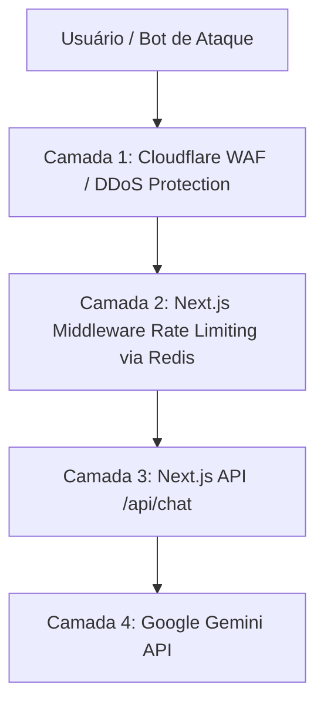

# ADR-0006: Arquitetura de Infraestrutura, Estrutura de Pastas, Escalabilidade e Proteção Contra DDoS

## Status
Proposto

## Data
2026-08-08

## Contexto
Para mover o agente da **Xperience Climb** de uma prova de conceito (PoC) para um ambiente de produção de alto desempenho, precisamos definir:
1. Uma **estrutura de pastas** clara e modular que facilite a manutenção e novos testes.
2. Uma **infraestrutura escalável** que aproveite o modelo serverless do Next.js sem sofrer com gargalos de conexão ao banco de dados ou latência.
3. Mecanismos de **proteção contra ataques DDoS e abusos de API** (especialmente nos endpoints de chat que se comunicam com o Gemini, cuja exploração irrestrita pode gerar custos financeiros elevados).

## Decisão

Adotaremos a seguinte arquitetura de infraestrutura, organização de pastas e políticas de segurança:

### 1. Estrutura de Pastas do Projeto
O projeto seguirá o padrão do Next.js App Router otimizado para IA:

```text
├── ai/                      # Configurações de modelos LLM (Gemini) e wrappers
│   ├── index.ts             # Instanciação dos modelos
│   ├── actions.ts           # Ações de geração estruturada (ex: pacotes, preços)
│   └── custom-middleware.ts # Customizações do Vercel AI SDK
├── app/                     # Next.js App Router (Páginas e rotas de API)
│   ├── (auth)/              # Módulo de Autenticação (NextAuth)
│   ├── (chat)/              # Módulo do Chat do Agente
│   │   ├── api/chat/        # Endpoint principal (streamText)
│   │   │   ├── route.ts     # Roteador e orquestrador do Chat
│   │   │   └── tools.ts     # Definição e lógica de execução das tools do agente
│   │   └── page.tsx         # Renderização da UI do Chat
│   ├── api/webhooks/        # Webhooks de pagamento e integração
│   ├── globals.css          # Estilos globais
│   └── layout.tsx           # Layout root da aplicação
├── components/              # Componentes de UI reusáveis (shadcn/ui e Vanilla/Tailwind)
│   ├── chat/                # Widgets específicos do chat (Cards de pacotes, feedback)
│   └── ui/                  # Componentes base (botões, inputs, dialogs)
├── db/                      # Camada de banco de dados
│   ├── schema.ts            # Esquemas do Postgres via Drizzle ORM
│   ├── queries.ts           # Queries otimizadas (chat, leads, feedback)
│   └── migrate.ts           # Script de migrações
├── docs/adr/                # Registros de Decisões de Arquitetura (ADRs)
├── lib/                     # Utilitários e dados estáticos
│   ├── data/                # Bases de conhecimento locais (ex: JSON de pacotes)
│   └── utils.ts             # Funções auxiliares
```

### 2. Infraestrutura e Escalabilidade (Serverless Stack)
*   **Hospedagem**: Vercel (com execução em Node.js Serverless Functions nas bordas/Edge Network para baixa latência).
*   **Banco de Dados**: Neon Postgres (Serverless PostgreSQL). O Neon escala os recursos de computação automaticamente a zero quando ociosos e suporta autoscaling durante picos de acessos.
*   **Gerenciamento de Conexões**: Utilizaremos o pool de conexões nativo do Neon (`@neondatabase/serverless`) via Drizzle ORM para evitar o esgotamento de portas de conexões de banco em execução serveless altamente concorrente.

### 3. Proteção Contra DDoS e Abusos Financeiros (Security & Cost Protection)
Endpoints que batem em LLMs (como `/api/chat`) são alvos críticos de DDoS de custo (Wallet-biting attacks). Implementaremos as seguintes camadas de proteção:



*   **Camada 1 - Proxy Reverso e WAF (Cloudflare/Vercel Shield)**:
    - Toda a resolução DNS passará pelo Cloudflare ou Vercel Web Application Firewall (WAF) ativo.
    - Ativação de mitigação automática de DDoS baseada em comportamento (HTTP Flood Protection).
*   **Camada 2 - Rate Limiting Dinâmico na Rota `/api/chat`**:
    - Implementação de um middleware no Next.js integrado com **Upstash Redis** (ou Vercel KV) utilizando o algoritmo *Token Bucket*.
    - *Limites*:
        - Usuários não autenticados: Máximo de 15 mensagens por minuto.
        - Usuários autenticados (clientes): Máximo de 60 mensagens por minuto.
    - Caso o limite seja excedido, o servidor retornará HTTP `429 Too Many Requests` imediatamente, sem repassar a chamada de tokens para o Gemini.
*   **Camada 3 - Limitação de Payload de Entrada**:
    - O middleware rejeitará mensagens do usuário com tamanho superior a 1000 caracteres.
    - Bloqueio de anexos de arquivo excessivos ou formatos não suportados.

## Alternativas Consideradas

*   **Hospedagem em VPS Tradicional (Docker / AWS EC2)**: Rejeitado para este MVP/PoC, pois exige gerenciamento manual de load balancers, sistemas operacionais e dimensionamento automático que a stack Vercel + Neon fornece nativamente de forma muito mais eficiente.
*   **Rate limit local em memória (in-memory lock)**: Rejeitado. Como as rotas do Next.js rodam em serverless functions efêmeras, o estado local em memória é destruído a cada execução, tornando o uso de um cache centralizado (Upstash Redis) obrigatório para rate limiting confiável.

## Consequências
*   **Pontos Positivos**:
    - Tolerância a picos massivos de tráfego com escalonamento automático de computação e banco de dados.
    - Blindagem contra ataques de negação de serviço e controle de custos de API da Google Gemini.
    - Organização limpa que facilita testes BDD automatizados devido ao desacoplamento das tools na pasta `app/(chat)/api/chat/tools.ts`.
*   **Pontos Negativos/Riscos**:
    - Introdução de custos mínimos do Upstash Redis (embora o plano gratuito seja abundante para a fase de PoC).
