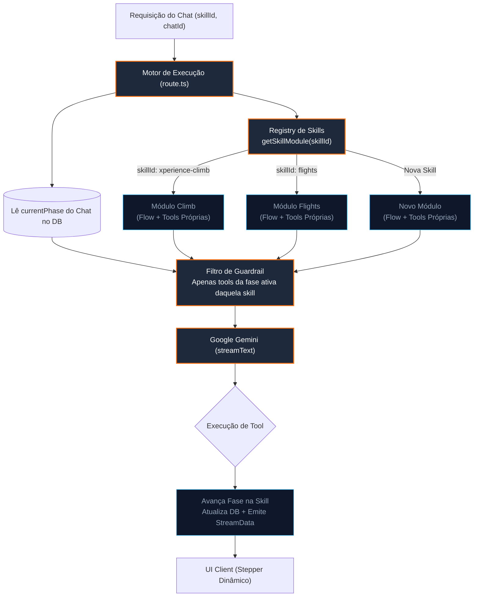

# ADR-0011: Padronização da Arquitetura Modular de Multi-Skills com Fluxos e Ferramentas Isolados

## Status
Aprovado

## Data
2026-08-12

## Contexto
A plataforma foi concebida para ser um assistente conversacional capaz de operar com **múltiplas especialidades (skills)** em paralelo (como a contratação de pacotes na `xperience-climb`, a reserva de voos em `flights`, ou futuras skills comerciais como locação de equipamentos).

Entretanto, a implementação acumulou acoplamentos estruturais que violam o princípio da modularidade:

1. **Monolito de Ferramentas (`tools.ts`)**: Ferramentas de domínios totalmente distintos (ex: `selectSeats` para voos, `createClimbBooking` para escalada e `getWeather` compartilhado) residiam centralizadas no mesmo arquivo [`tools.ts`](file:///Users/govinda/projetos/gemini-chatbot/app/%28chat%29/api/chat/tools.ts), criando confusão de dependências e risco de quebras cruzadas.
2. **Ausência de Fluxo Formal por Skill**: O arquivo [`skills-registry.ts`](file:///Users/govinda/projetos/gemini-chatbot/lib/ai/skills-registry.ts) tratava cada habilidade como um bloco solto de texto em linguagem natural (`systemPrompt`) e um array plano de nomes de ferramentas (`allowedTools`). Não havia uma definição estruturada de **fases de atendimento**, **guardrails** ou **transições** que cada skill precisa seguir.
3. **Acoplamento no Banco de Dados**: A tabela `Chat` continha um valor padrão hardcoded `default("flights")` na coluna `skillId`, enviesando a infraestrutura que deveria ser agnóstica a domínios.
4. **Acoplamento na Interface (UI)**: O componente [`message.tsx`](file:///Users/govinda/projetos/gemini-chatbot/components/custom/message.tsx) importava diretamente componentes específicos de voos e de escalada em uma longa cadeia condicional (`if/else`), impedindo a adição de novas skills sem modificar o componente de exibição central.

## Decisão
Decidimos estabelecer um padrão arquitetural estrito para **Multi-Skills Modulares**, onde **cada Skill é um módulo autocontido**, portador de suas próprias ferramentas, regras de fluxo conversacional e mapeamento de componentes de interface.

---

### 1. Contrato Universal de Módulo de Skill (`lib/skills/types.ts`)

Toda e qualquer skill integrada ao chatbot deve implementar o contrato universal de módulo:

```typescript
import { CoreTool } from 'ai';

export interface PhaseConfig {
  id: string;
  name: string;
  allowedTools: string[];
  instructions: string;
}

export interface SkillFlowDefinition<TPhase extends string = string> {
  initialPhase: TPhase;
  phases: Record<TPhase, PhaseConfig>;
  transitionRules: Record<TPhase, TPhase[]>;
}

export interface SkillModule<TPhase extends string = string> {
  id: string;
  name: string;
  description: string;
  systemPromptTemplate: string;
  flow: SkillFlowDefinition<TPhase>;
  tools: Record<string, CoreTool<any, any>>;
  theme: {
    primaryColor: string;
    backgroundColor: string;
    accentColor: string;
    mode: 'light' | 'dark';
  };
}
```

---

### 2. Estrutura de Diretórios Isolada por Domínio

Cada skill residirá em seu próprio diretório sob `lib/skills/`:

```
lib/skills/
├── types.ts                    # Contratos e interfaces universais (SkillModule, Flow, Phase)
├── registry.ts                 # Indexador e factory dinâmica: getSkillModule(skillId)
├── shared/                     # Utilitários e ferramentas transversais
│   └── tools/
│       └── weather.ts          # Ex: tool de previsão do tempo compartilhada
├── climb/                      # Módulo da Xperience Climb
│   ├── index.ts                # Exporta o SkillModule do Climb
│   ├── flow.ts                 # Fases: discovery -> booking -> payment -> post_sale
│   └── tools.ts                # Tools: searchClimbKnowledge, listClimbPackages, createClimbBooking...
└── flights/                    # Módulo de Voos
    ├── index.ts                # Exporta o SkillModule de Voos
    ├── flow.ts                 # Fases: search -> seat_selection -> booking -> payment -> boarding
    └── tools.ts                # Tools: searchFlights, selectSeats, createReservation, authorizePayment...
```

---

### 3. Motor de Execução Totalmente Agnóstico (`route.ts`)

A rota de chat [`route.ts`](file:///Users/govinda/projetos/gemini-chatbot/app/%28chat%29/api/chat/route.ts) deixa de conter qualquer conhecimento sobre regras de escalada ou de voos. O motor opera como uma casca pura de orquestração:

1. **Resolução Dinâmica da Skill**: Obtém a skill ativa via `getSkillModule(skillId)`.
2. **Leitura da Fase Corrente**: Recupera o `currentPhase` salvo no chat (ou utiliza `skill.flow.initialPhase` como início).
3. **Hard Guardrail por Fase**: Filtra as ferramentas enviadas ao Gemini, liberando **apenas** `skill.flow.phases[currentPhase].allowedTools`.
4. **Construção do Prompt da Fase**: Concatena o prompt base da skill com a diretriz da fase atual.
5. **Streaming com Telemetria**: Executa `streamText` repassando as ferramentas e transmitindo eventos via `StreamData`.

```typescript
// Exemplo no route.ts desacoplado:
const skill = getSkillModule(skillId);
const currentPhase = chat?.currentPhase || skill.flow.initialPhase;
const phaseConfig = skill.flow.phases[currentPhase];

// Hard Guardrail estrito:
const activeTools = Object.fromEntries(
  Object.entries(skill.tools).filter(([name]) => phaseConfig.allowedTools.includes(name))
);

const result = await streamText({
  model: geminiFlashModel,
  system: `${skill.systemPromptTemplate}\n\nFase Atual: ${phaseConfig.name}\nDiretriz: ${phaseConfig.instructions}`,
  messages: coreMessages,
  tools: activeTools,
});
```

---

### 4. Desacoplamento da Persistência (Banco de Dados)

Na tabela `Chat` do PostgreSQL (Drizzle ORM):
- O default hardcoded `default("flights")` na coluna `skillId` é removido.
- A coluna `skillId` torna-se uma chave de identificação neutra informada na abertura da conversa ou configurada por tenant/ambiente.
- A coluna `currentPhase` armazena a fase da conversa de forma genérica, validada contra a máquina de fluxo da skill correspondente.

---

### 5. Diagrama da Arquitetura Multi-Skills com Fluxos



---

## Consequências

### Pontos Positivos
* **Convivência Saudável de Múltiplas Skills**: Voos, escalada e qualquer futura habilidade coexistem sem poluição ou conflitos de código.
* **Isolamento de Erros e Responsabilidades**: Alterar ou evoluir as ferramentas de uma skill não impacta nem coloca em risco as demais.
* **Fim do Monolito `tools.ts`**: Cada ferramenta reside junto ao seu domínio de negócio.
* **Motor Estável e Blindado**: `route.ts` permanece imutável e focado exclusivamente em transporte, streaming e segurança.
* **Cada Skill com seu Fluxo**: Toda habilidade ganha garantias formais de estados, transições e guardrails (FSM).

### Riscos e Mitigações
* **Migração Inicial de Arquivos**: Mover ferramentas de `app/(chat)/api/chat/tools.ts` para os módulos `lib/skills/climb/tools.ts` e `lib/skills/flights/tools.ts`. Essa movimentação deve ser feita preservando os contratos de tipagem e a suíte de testes do Vitest.
