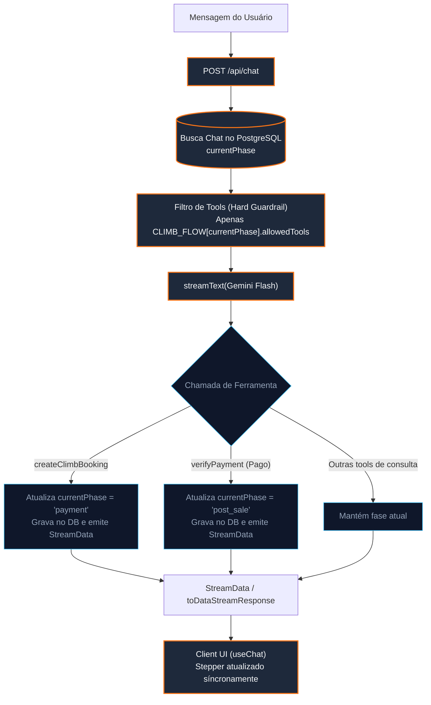

# ADR-0012: Implementação de FSM Orientada por Efeitos de Ferramentas (Hard Guardrails) na Skill Xperience Climb

## Status
Aprovado

## Data
2026-08-12

## Contexto
Com a padronização da arquitetura modular de multi-skills estabelecida na **ADR-0011**, cada habilidade do sistema precisa definir seu próprio fluxo formal de atendimento e isolar suas ferramentas.

Na skill **Xperience Climb**, o fluxo conversacional comercial (*Descoberta* $\to$ *Reserva* $\to$ *Pagamento* $\to$ *Pós-Venda*) anteriormente estava expresso apenas em linguagem natural dentro do `systemPrompt`. Todas as ~8 ferramentas eram disponibilizadas simultaneamente para a função `streamText`, tornando o modelo suscetível a alucinações de tool-calling fora de ordem (como tentar emitir links de checkout antes da reserva existir).

Além disso, as heurísticas de leitura de capacidades no script [`scripts/analyze-bot.ts`](file:///Users/govinda/projetos/gemini-chatbot/scripts/analyze-bot.ts) utilizavam expressões regulares para varrer o texto do prompt e extrair fluxos para alimentar o dashboard [`Overview.tsx`](file:///Users/govinda/projetos/gemini-chatbot/components/custom/overview.tsx).

Após avaliação de frameworks externos (como LangGraph.js e XState), concluiu-se que adicionar essas bibliotecas traria dependências desnecessárias, alto acoplamento e reescrita indesejada da camada de streaming e ferramentas do Vercel AI SDK.

## Decisão
Decidimos implementar o padrão arquitetural **FSM Orientada por Efeitos de Ferramentas (Tool-Driven FSM)** com **Zero Dependências Novas**, acoplado à remoção definitiva do código legado de voos.

### 1. Fonte Única da Verdade Declarativa (`config/climbFlow.ts`)
Criaremos a declaração estrita e tipada das fases do agente:

```typescript
export type FlowPhase = 'discovery' | 'booking' | 'payment' | 'post_sale';

export interface PhaseDefinition {
  id: FlowPhase;
  name: string;
  allowedTools: string[];
  instructions: string;
  next?: FlowPhase;
}

export const CLIMB_FLOW: Record<FlowPhase, PhaseDefinition> = {
  discovery: {
    id: 'discovery',
    name: 'Descoberta e Pacotes',
    allowedTools: ['searchClimbKnowledge', 'listClimbPackages', 'getWeather'],
    instructions: 'Ajude o escalador a escolher a melhor rota. Sugira pacotes compatíveis com seu nível de experiência.',
    next: 'booking',
  },
  booking: {
    id: 'booking',
    name: 'Reserva de Vagas',
    allowedTools: ['createClimbBooking', 'listClimbPackages'],
    instructions: 'Colete as datas e número de vagas para formalizar o pré-agendamento da expedição.',
    next: 'payment',
  },
  payment: {
    id: 'payment',
    name: 'Pagamento e Confirmação',
    allowedTools: ['generatePaymentLink', 'verifyPayment'],
    instructions: 'Apresente o link de checkout e confirme a compensação do pagamento.',
    next: 'post_sale',
  },
  post_sale: {
    id: 'post_sale',
    name: 'Pós-Venda e LGPD',
    allowedTools: ['saveLeadInfo', 'submitUserFeedback'],
    instructions: 'Colete o consentimento LGPD para comunicações futuras e solicite feedback sobre o atendimento.',
  },
};
```

### 2. Hard Guardrails no Route Handler (`route.ts`)
O Route Handler identificará a fase ativa do chat no banco de dados e enviará para o `streamText` **estritamente as ferramentas permitidas para a fase atual**. O modelo é fisicamente incapaz de chamar ferramentas fora do seu escopo de execução.

```typescript
// Filtragem estrita de ferramentas por fase
const phaseConfig = CLIMB_FLOW[currentPhase];
const authorizedTools = Object.fromEntries(
  Object.entries(allTools).filter(([name]) => phaseConfig.allowedTools.includes(name))
);
```

### 3. Transição Determinística de Fase por Efeito Colateral
Quem avança o estágio não é a interpretação em texto do modelo, mas a execução bem-sucedida das ferramentas de fronteira:
- `createClimbBooking` (execução com sucesso) $\to$ Transiciona para `payment`.
- `verifyPayment` (com `hasCompletedPayment: true`) $\to$ Transiciona para `post_sale`.
- Cancelamento de reserva $\to$ Retorna para `discovery`.

A integridade das transições é validada por um guardrail simples (`WorkflowGuard.assertCanTransition`).

### 4. Persistência Leve no PostgreSQL (Neon + Drizzle)
Adicionaremos a coluna `currentPhase` na tabela `Chat` existente:
```typescript
currentPhase: varchar("currentPhase", { length: 32 })
  .$type<FlowPhase>()
  .default("discovery")
  .notNull(),
```
Como o `route.ts` já consulta o registro do `Chat` por ID no início de cada requisição, a recuperação da fase tem **latência de 0ms adicionais**.

### 5. Sincronização em Tempo Real com a UI (`StreamData`)
O servidor emitirá eventos e anotações através do `StreamData` nativo do Vercel AI SDK (`appendMessageAnnotation`). O hook cliente `useChat` recebe a fase atual em tempo real e renderiza um **Stepper de Progresso** no topo da conversa.

### 6. Expurgo Definitivo do Legado de Voos
1. Exclusão dos componentes em `components/flights/*`.
2. Remoção das ferramentas `searchFlights`, `selectSeats`, `createReservation` (voos), `authorizePayment`, `displayFlightStatus` e `displayBoardingPass` de `tools.ts`.
3. Remoção do registro `flights` em `skills-registry.ts`, consolidando o Xperience Climb como agente padrão.
4. Limpeza das ramificações condicionais em `components/custom/message.tsx` e `components/custom/overview.tsx`.

### 7. Observabilidade e Emissão de Eventos de Fase (Event-Driven Telemetry)
Para garantir visibilidade em tempo real do que está acontecendo em cada etapa do fluxo (tanto para o usuário na interface quanto para fins de auditoria, integrações e métricas), cada fase e transição emitirá eventos estruturados e tipados:

```typescript
export type PhaseEventType = 
  | 'PHASE_ENTERED'     // Emitido ao iniciar o processamento da fase ativa
  | 'PHASE_TRANSITION'  // Emitido no momento em que uma ferramenta comuta a fase
  | 'TOOL_CALLED';      // Emitido quando uma ferramenta é acionada

export interface PhaseEvent {
  type: PhaseEventType;
  chatId: string;
  userId: string;
  phase: FlowPhase;
  fromPhase?: FlowPhase;
  toPhase?: FlowPhase;
  toolName?: string;
  metadata?: Record<string, any>;
  timestamp: number;
}
```

#### 7.1 Como Ouvir e Subscrever os Eventos

1. **No Cliente (Frontend / React via `useChat`):**
   O hook `useChat` do `@ai-sdk/react` recebe os chunks de `StreamData` através do array reativo `data`. O cliente pode escutar os eventos criando um hook customizado `useWorkflowEvents`:
   ```typescript
   export function useWorkflowEvents(data: any[] | undefined) {
     const workflowEvents = useMemo(() => {
       if (!data) return [];
       return data.filter((item): item is PhaseEvent => item?.isWorkflowEvent === true);
     }, [data]);

     const latestEvent = workflowEvents[workflowEvents.length - 1];
     return { workflowEvents, latestEvent };
   }
   ```
   **Disparo de Toasts e Atualizações de Tela:** O componente de chat pode acionar efeitos (`useEffect`) quando `latestEvent.type === 'PHASE_TRANSITION'`, emitindo sons, mensagens comemorativas (*"Reserva Gerada com Sucesso!"*) ou atualizando o Stepper.

2. **No Servidor / Background (Node.js EventBus & Webhooks):**
   No servidor, o módulo de transição dispara eventos através de um `EventEmitter` interno assíncrono ou despachante de Webhooks:
   ```typescript
   import { workflowEmitter } from "@/lib/workflow/events";

   // Consumidores internos registram ouvintes no boot da aplicação:
   workflowEmitter.on("PHASE_TRANSITION", async (event: PhaseEvent) => {
     await logAuditTrail(event);
     if (event.toPhase === "payment") {
       await notifySalesTeam(event);
     }
   });
   ```

#### 7.2 Catálogo de Consumidores do Fluxo

| Consumidor | Camada | Objetivo / Ação |
| :--- | :--- | :--- |
| **Stepper de Jornada (`JourneyStepper.tsx`)** | Client UI | Exibir a barra de progresso em tempo real e o pulso de status ativo para o cliente. |
| **Notificações em Tela (Toasts)** | Client UI | Notificar o usuário visualmente sobre transições críticas (ex: reserva confirmada, link de pagamento pronto). |
| **Auditoria e Métricas de Funil (`test-reporter.ts`)** | Backend | Medir a taxa de conversão do funil de vendas (Descoberta $\to$ Reserva $\to$ Pagamento $\to$ Pós-Venda) e tempo gasto por fase. |
| **CRM / Notificação Comercial (Slack / WhatsApp Webhook)** | Integração Externa | Alertar a equipe comercial humana no exato instante em que uma reserva entra na fase de pagamento para suporte ativo ao checkout. |

#### 7.3 Diretrizes de Segurança e Proteção de Dados (LGPD)

1. **Mascaramento e Higienização de PII (Personally Identifiable Information):**
   * **Regra Estrita**: Nenhum dado sensível (CPF, dados de cartão de crédito, senhas ou tokens bancários) pode ser trafegado no payload `metadata` dos eventos de fase.
   * Dados de contato capturados na fase `post_sale` (`saveLeadInfo`) são persistidos de forma segura na tabela `Lead` e emitidos no evento apenas como IDs anônimos (`{ leadId: "lead_123", consentGranted: true }`), nunca com e-mail ou telefone abertos no stream.
2. **Prevenção de Injeção e Manipulação de Estado:**
   * O cliente é estritamente **passivo (read-only)** em relação aos eventos de fase. O cliente **não pode** enviar mensagens manipuladas dizendo *"mudei para payment"*. Quem define e transiciona o estado é exclusivamente o servidor dentro dos callbacks `execute` das ferramentas no backend.
3. **Imutabilidade e Idempotência:**
   * Toda transição valida se o estado de destino é permitido via `WorkflowGuard`. Se uma ferramenta for executada duas vezes (retry por instabilidade de rede), a transição não corrompe o estado da sessão.

#### 7.4 Autenticação e Autorização (RBAC & Tenant Ownership)

1. **Autenticação Obrigatória de Sessão (NextAuth v5):**
   * Todas as emissões e leituras de eventos passam pela validação da sessão do usuário via `auth()`. Requisições não autenticadas recebem `HTTP 401 Unauthorized` de imediato no `route.ts`.
2. **Verificação Estrita de Propriedade do Chat (Chat Ownership Guard):**
   * Um usuário **só pode escutar eventos e interagir com conversas pertencentes a seu próprio `userId`**:
     ```typescript
     const chat = await getChatById({ id: chatId });
     if (chat && chat.userId !== session.user.id) {
       return new Response("Forbidden: You do not own this chat session", { status: 403 });
     }
     ```
   * Isso impede que usuários maliciosos inspecionem eventos de pagamento ou reservas de outros clientes.
3. **Autenticação em Webhooks de Integração Externa:**
   * Caso os eventos sejam despachados para endpoints de webhook externos (ex: CRM ou ERP da Xperience Climb), o payload será assinado via **HMAC SHA-256** utilizando a chave secreta `WORKFLOW_WEBHOOK_SECRET` no cabeçalho `X-Climb-Signature`, permitindo ao destinatário validar a autenticidade da origem.

---

## Diagrama da Arquitetura FSM Orientada por Tools



---

## Consequências

### Pontos Positivos
* **Zero Novas Dependências**: Mantém a base de código enxuta sem necessidade de `@langchain/*` ou bibliotecas de runtime adicionais.
* **100% Idiomático com Next.js & Vercel AI SDK**: Mantém o ecossistema atual de streaming, Server Actions e hooks intacto.
* **Blindagem Total contra Alucinações**: A IA não consegue chamar ferramentas fora de ordem porque elas sequer são enviadas no payload da requisição.
* **Fonte Única da Verdade**: `config/climbFlow.ts` alimenta os prompts, a filtragem de tools, o script `analyze-bot.ts` e o Stepper da UI.
* **Base Despoluída**: Eliminação total de código morto de reservas de voo.

### Riscos e Mitigações
* **Migração de Banco de Dados**: A adição da coluna `currentPhase` com default `'discovery'` é não-bloqueante e retrocompatível com conversas já existentes.
