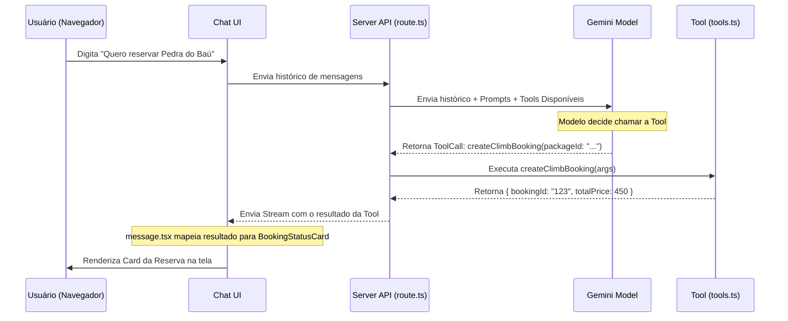

# Estratégia de Algoritmo de IA e Ciclo de Vida das Ferramentas (Tools)

Este documento detalha o funcionamento interno, a estratégia algorítmica e o ciclo de vida das ferramentas (*tools*) que regem o assistente de IA da **Xperience Climb**.

---

## 🧠 1. Estratégia de Algoritmo da IA

O chatbot baseia-se em uma arquitetura de **Orquestração Dinâmica de Contexto** usando o **Vercel AI SDK** e os modelos **Google Gemini** (principalmente `gemini-1.5-flash`).

### A. Fluxo de Conversação e Inicialização
1.  **Entrada do Usuário**: A requisição chega à rota [`route.ts`](./app/%28chat%29/api/chat/route.ts).
2.  **Identificação do Contexto (Skill)**: A API verifica o `skillId` ativo (ex: `xperience-climb` para o bot de montanhismo).
3.  **Injeção de Prompts & Sandboxing**:
    *   A API carrega a configuração da skill a partir do [`skills-registry.ts`](./lib/ai/skills-registry.ts).
    *   O `systemPrompt` específico da skill é inserido como prompt do sistema.
    *   As ferramentas (*tools*) permitidas são filtradas. **Nenhuma ferramenta fora da lista autorizada é enviada para o modelo**, garantindo segurança e economizando tokens de contexto.
4.  **Streaming com o Modelo**: A função `streamText` é iniciada.

```typescript
const result = await streamText({
  model: geminiFlashModel,
  system: skill.systemPrompt,
  messages: coreMessages,
  tools: allowedTools, // Apenas as ferramentas filtradas para esta skill
  // ...
});
```

---

## 🛠️ 2. Arquitetura e Ciclo de Vida das Tools

As ferramentas permitem que a IA realize ações no mundo real (consultar bancos de dados, gravar leads, gerar links de pagamentos). A definição das ferramentas comerciais e de suporte está localizada em [`tools.ts`](./app/%28chat%29/api/chat/tools.ts).

### A. Anatomia de uma Tool
Cada ferramenta segue a estrutura de tipagem do Vercel AI SDK:
1.  **`description`**: Uma descrição textual precisa de quando a ferramenta deve ser acionada. O modelo Gemini lê esta descrição para decidir se deve ou não chamar a ferramenta.
2.  **`parameters`**: Um schema Zod que define os dados que a IA precisa extrair da conversa para enviar à ferramenta.
3.  **`execute`**: Uma função assíncrona executada no servidor que recebe os parâmetros validados, realiza as consultas/gravações e retorna um objeto JSON.

---

## 🔄 3. O Ciclo de Vida do Tool Calling (Servidor ➔ Cliente)



### Estados de Renderização no Cliente
O componente [`message.tsx`](./components/custom/message.tsx) monitora o estado de execução da ferramenta de duas formas:

1.  **Estado Executando/Pendente (`state !== "result"`)**:
    *   Exibe um esqueleto de carregamento animado (*skeleton loader*) ou uma interface interativa preliminar para que o usuário preencha dados (como o formulário de feedback [`FeedbackForm`](./components/climb/climb-components.tsx#L218)).
2.  **Estado Concluído (`state === "result"`)**:
    *   A interface recebe o JSON retornado pela função `execute` e renderiza o componente final rico correspondente.

---

## 📚 4. Catálogo de Ferramentas da Skill `xperience-climb`

| Ferramenta | Descrição / Objetivo da IA | Componente Renderizado |
|---|---|---|
| `searchClimbKnowledge` | Realiza busca semântica/textual em [`climb-knowledge.json`](./lib/data/climb-knowledge.json) para dúvidas de segurança e logística. | Visualizador JSON / Texto puro do agente |
| `listClimbPackages` | Lista os passeios de escalada disponíveis cadastrados no banco de dados. | [`ClimbPackageCard`](./components/climb/climb-components.tsx#L7) |
| `createClimbBooking` | Cria um registro temporário de reserva vinculada a um evento/data específica. | [`BookingStatusCard`](./components/climb/climb-components.tsx#L82) (Modo Resumo) |
| `generatePaymentLink` | Gera e vincula o link de checkout e QR Code PIX para a reserva criada. | [`BookingStatusCard`](./components/climb/climb-components.tsx#L82) (Modo Pagamento) |
| `verifyPayment` | Consulta o status de pagamento de uma reserva simulada. | [`PaymentStatusView`](./components/climb/climb-components.tsx#L192) (Se pago) |
| `saveLeadInfo` | Registra os dados de contato do cliente (email, whatsapp) sob as diretrizes da LGPD. | Mensagem de Sucesso (Alerta de Confirmação) |
| `submitUserFeedback` | Envia e armazena a avaliação de estrelas do atendimento do chatbot. | [`FeedbackForm`](./components/climb/climb-components.tsx#L218) |

---

> [!IMPORTANT]
> **Políticas de Engenharia de Prompt e Data Handling**:
> 1. **Data Fixa**: A IA **nunca** deve chutar ou perguntar uma data livre para a reserva. Os pacotes de escalada dependem de calendário fixo (`nextDate` de `listClimbPackages`).
> 2. **Consentimento LGPD**: A ferramenta `saveLeadInfo` só deve ser acionada caso o usuário dê consentimento explícito na conversa ao ser questionado.
