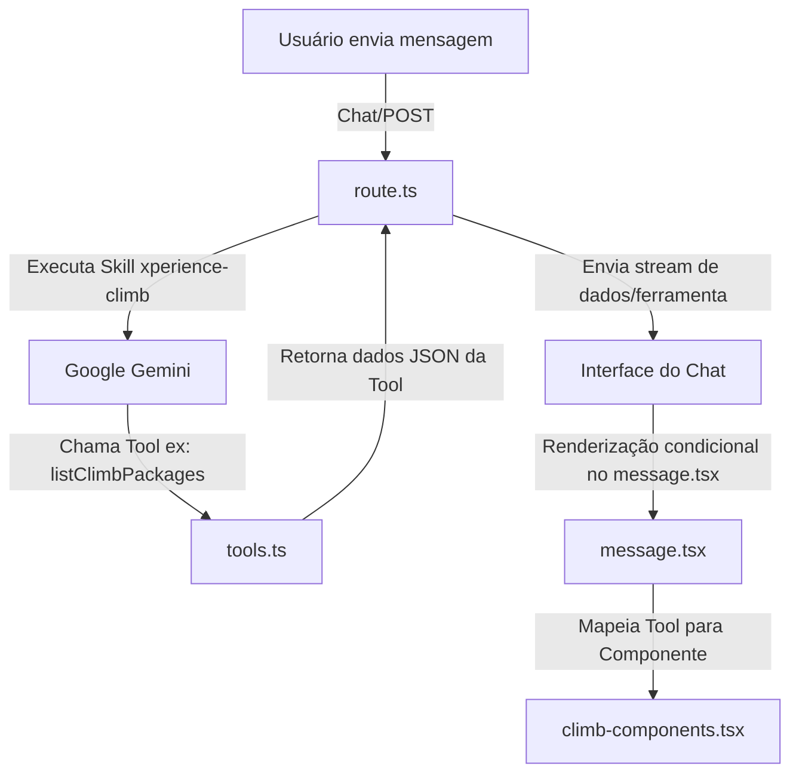

# Guia de Componentes Climb e Integração com a IA

Este guia explica detalhadamente como o assistente de inteligência artificial (IA) interage e utiliza os componentes React customizados definidos no arquivo [`climb-components.tsx`](./components/climb/climb-components.tsx).

Para atingir uma experiência de usuário premium e conversacional, o chatbot não exibe apenas respostas textuais simples. Ele renderiza componentes ricos dinamicamente no fluxo da conversa com base nas ferramentas (*tools*) acionadas pelo modelo Gemini.

---

## 🗺️ Visão Geral do Fluxo de Renderização

A orquestração entre a chamada da ferramenta pela IA e a renderização do componente visual funciona de acordo com o seguinte fluxo:



A ponte entre a execução das ferramentas no servidor e os componentes no cliente é estabelecida em [`message.tsx`](./components/custom/message.tsx), que escuta os eventos de `toolInvocations` da resposta do Vercel AI SDK.

---

## 🧩 Componentes Disponíveis e Associação com Tools

O arquivo [`climb-components.tsx`](./components/climb/climb-components.tsx) exporta quatro componentes principais. Veja abaixo o que cada um faz, as propriedades (*props*) que espera e qual ferramenta da IA o dispara.

### 1. [`ClimbPackageCard`](./components/climb/climb-components.tsx#L7)
*   **Propósito**: Exibe um card interativo com detalhes de um pacote de escalada específico (dificuldade, duração, descrição, local, inclusões e preços).
*   **Acionado pela Tool**: `listClimbPackages`
*   **Como a IA usa**: Quando o usuário pesquisa por atividades de escalada disponíveis ou pergunta por destinos de aventura, a IA executa a ferramenta de listagem de pacotes. Cada item retornado na lista gera um card correspondente no chat.
*   **Tipagem das Props**:
    ```typescript
    pkg: {
      id: string;
      name: string;
      difficulty: string;     // 'iniciante', 'intermediario', 'avancado'
      duration: string;       // ex: '1 dia', 'fim de semana'
      priceInBRL: number;     // Valor promocional ou atual
      originalPriceInBRL?: number; // Preço antigo tachado (opcional)
      description: string;
      location: string;       // Cidade e UF do destino
      inclusions: string[];   // Lista de equipamentos ou serviços inclusos
    }
    ```

### 2. [`BookingStatusCard`](./components/climb/climb-components.tsx#L82)
*   **Propósito**: Mostra o resumo detalhado de uma reserva que acabou de ser criada, incluindo informações dos participantes, data selecionada, preço total e as opções de pagamento disponíveis (cartão de crédito ou PIX via QR Code mockado).
*   **Acionado pelas Tools**: `createClimbBooking` e `generatePaymentLink`
*   **Como a IA usa**: 
    1. O usuário manifesta desejo de reservar um passeio.
    2. A IA invoca `createClimbBooking` que retorna os dados da reserva temporária. Isso renderiza o [`BookingStatusCard`](./components/climb/climb-components.tsx#L82) sem as opções de pagamento (apenas o resumo).
    3. A IA então gera o link de pagamento executando `generatePaymentLink`. Os dados adicionais de pagamento são repassados ao componente, ativando os botões de checkout e a seção de PIX.
*   **Tipagem das Props**:
    ```typescript
    booking: {
      bookingId: string;
      packageId: string;
      packageName: string;
      date: string;
      participants: number;
      priceInBRL: number;
      totalPriceBRL: number;
      location: string;
    };
    paymentDetails?: {
      paymentUrl: string;
      pixQrCode: string;
      amount: number;
    }
    ```

### 3. [`PaymentStatusView`](./components/climb/climb-components.tsx#L192)
*   **Propósito**: Apresenta uma tela de sucesso com micro-animações CSS e ícones animados para celebrar a confirmação do pagamento.
*   **Acionado pela Tool**: `verifyPayment`
*   **Como a IA usa**: Quando o usuário clica em "Simular Confirmação de Pagamento" (ou avisa à IA que concluiu o PIX) e a ferramenta `verifyPayment` retorna que o pagamento foi processado com sucesso (`hasCompletedPayment: true`), a interface substitui o painel de checkout por este feedback de sucesso.
*   **Tipagem das Props**:
    ```typescript
    success: boolean;
    message?: string;
    ```

### 4. [`FeedbackForm`](./components/climb/climb-components.tsx#L218)
*   **Propósito**: Exibe um componente interativo de avaliação por estrelas (1 a 5 estrelas) com um campo de texto livre para feedback do atendimento comercial.
*   **Acionado pela Tool**: `submitUserFeedback`
*   **Como a IA usa**: Quando o fluxo comercial chega ao fim ou o usuário solicita avaliar a experiência, o formulário de feedback é exibido no chat. O estado pendente da ferramenta (antes do resultado final ser submetido) exibe a interface com estrelas selecionáveis.
*   **Tipagem das Props**:
    ```typescript
    onSubmit: (rating: number, comment: string) => void;
    ```

---

## 🛠️ Onde a Integração Ocorre no Código

O ponto centralizador que decide qual componente renderizar para cada ferramenta está em [`message.tsx`](./components/custom/message.tsx). Abaixo está o trecho correspondente no mapeamento de ferramentas:

```typescript
// Renderização no estado "result" (após execução com sucesso)
{toolName === "listClimbPackages" ? (
  <div className="flex flex-col gap-3">
    {(() => {
      const packages = Array.isArray(result) ? result : result?.packages;
      return Array.isArray(packages) && packages.length > 0 ? (
        packages.map((pkg: any) => (
          <ClimbPackageCard key={pkg.id} pkg={pkg} />
        ))
      ) : (
        <div className="text-xs text-slate-400">Nenhum pacote encontrado.</div>
      );
    })()}
  </div>
) : toolName === "createClimbBooking" ? (
  result.error ? (
    <div className="text-xs text-rose-400">{result.error}</div>
  ) : (
    <BookingStatusCard booking={result} />
  )
) : toolName === "generatePaymentLink" ? (
  result.error ? (
    <div className="text-xs text-rose-400">{result.error}</div>
  ) : (
    <BookingStatusCard
      booking={{
        bookingId: result.bookingId,
        packageId: "",
        packageName: "Reserva de Escalada Xperience",
        date: "Data Agendada",
        participants: 1,
        priceInBRL: result.amount,
        totalPriceBRL: result.amount,
        location: "",
      }}
      paymentDetails={result}
    />
  )
) : toolName === "verifyPayment" ? (
  result.hasCompletedPayment ? (
    <PaymentStatusView success={true} />
  ) : (
    <VerifyPayment result={result} />
  )
) : null}
```

E no estado interativo ou de carregamento (antes de obter o resultado final do servidor):

```typescript
// Renderização no estado pendente
{toolName === "submitUserFeedback" ? (
  <FeedbackForm
    onSubmit={(rating, comment) => {
      console.log("Feedback rating:", rating, "comment:", comment);
    }}
  />
) : (
  <div className="text-xs text-slate-500 animate-pulse">Carregando ferramenta {toolName}...</div>
)}
```

---

> [!NOTE]
> Para testar visualmente esses componentes individualmente e verificar como o modelo de dados de cada ferramenta está estruturado em schemas Zod, acesse o **Playground de Ferramentas** rodando o projeto localmente em `http://localhost:3000/tools`.
