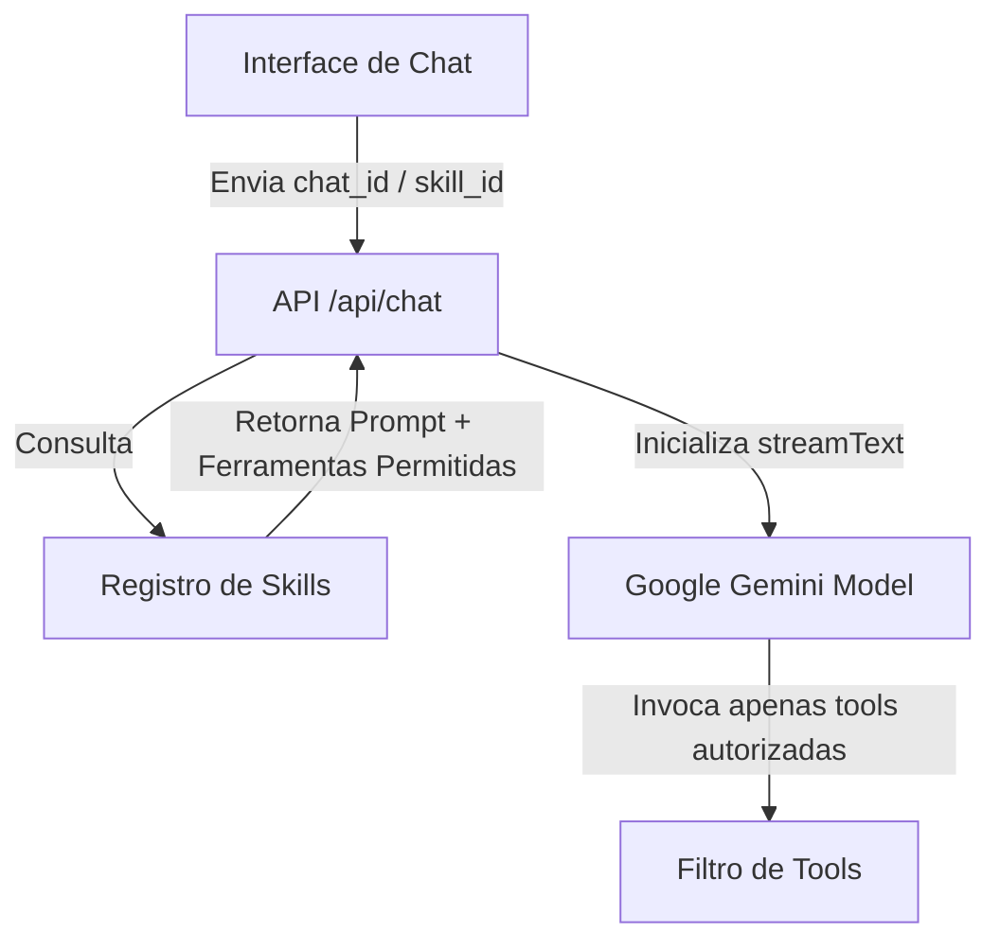

# Guia de Personalização do Chatbot (Arquitetura de Skills)

Este guia explica detalhadamente como o chatbot está estruturado de forma modular para suportar múltiplos objetivos, ferramentas (*tools*) e fluxos de atendimento sem deletar o código legado. 

A arquitetura baseia-se em um **Registro de Skills Dinâmico**, permitindo que o robô mude sua persona e conjunto de habilidades (como mudar do fluxo legado de voos para o atendimento da **Xperience Climb**).

---

## 1. Visão Geral da Arquitetura Dinâmica

Em vez de codificar regras fixas na API, delegamos o comportamento do bot a perfis de configuração dinâmicos chamados **Skills**:



O fluxo de processamento dinâmico funciona assim:
1. **Determinação do Contexto**: A API identifica qual skill deve rodar (ex: lendo parâmetros da URL, metadados associados ao chat no banco de dados ou variáveis de ambiente).
2. **Carregamento da Skill**: A API busca as configurações associadas (System Prompt correspondente ao objetivo e lista de ferramentas permitidas).
3. **Inicialização do Gemini**: O `streamText` é alimentado apenas com as instruções e as ferramentas específicas daquela skill.

---

## 2. O Registro de Skills (`lib/ai/skills-registry.ts`)

Para criar ou modificar objetivos do bot, declaramos as configurações em um arquivo centralizado (ex: `lib/ai/skills-registry.ts`).

### Exemplo de Estrutura do Registro:

```typescript
export interface SkillConfig {
  id: string;
  name: string;
  systemPrompt: string;
  allowedTools: string[]; // Lista de chaves de ferramentas permitidas
}

export const SKILLS_REGISTRY: Record<string, SkillConfig> = {
  // 1. Skill Legada (Reserva de Voos)
  'flights': {
    id: 'flights',
    name: 'Reserva de Voos',
    systemPrompt: `
      - you help users book flights!
      - keep your responses limited to a sentence.
      - DO NOT output lists.
    `,
    allowedTools: ['getWeather', 'searchFlights', 'selectSeats', 'createReservation', 'verifyPayment', 'displayBoardingPass']
  },

  // 2. Nova Skill (Xperience Climb)
  'xperience-climb': {
    id: 'xperience-climb',
    name: 'Atendimento Xperience Climb',
    systemPrompt: `
      - Você é o assistente inteligente da Xperience Climb (climb.xperiencehubs.com).
      - Seu objetivo é tirar dúvidas sobre montanhismo, apresentar os pacotes de escalada e qualificar leads.
      - Siga este fluxo de atendimento:
        1. Responda a dúvidas gerais do usuário sobre as escaladas (use a ferramenta searchClimbKnowledge).
        2. Apresente pacotes disponíveis.
        3. Caso o usuário queira reservar ou saber mais, use saveLeadInfo para coletar nome, e-mail e WhatsApp.
      - Mantenha respostas amigáveis e curtas.
    `,
    allowedTools: ['getWeather', 'searchClimbKnowledge', 'saveLeadInfo', 'submitUserFeedback']
  }
};
```

---

## 3. Modificando a Rota do Chat (`app/(chat)/api/chat/route.ts`)

Na rota principal, em vez de passar todas as tools e prompts estáticos, filtramos as ferramentas antes de enviá-las ao `streamText`:

```typescript
import { SKILLS_REGISTRY } from "@/lib/ai/skills-registry";
import { allTools } from "@/ai/all-tools"; // Objeto contendo a definição de todas as tools (voo e climb)

export async function POST(request: Request) {
  const { id, messages, skillId = "flights" } = await request.json(); // skillId pode vir do chat ou body
  
  // 1. Carrega a configuração da Skill desejada
  const activeSkill = SKILLS_REGISTRY[skillId] || SKILLS_REGISTRY["flights"];

  // 2. Filtra as tools autorizadas para essa skill
  const filteredTools = Object.keys(allTools)
    .filter(toolName => activeSkill.allowedTools.includes(toolName))
    .reduce((obj, key) => {
      obj[key] = allTools[key];
      return obj;
    }, {} as any);

  // 3. Executa o streaming com o contexto dinâmico
  const result = await streamText({
    model: geminiFlashModel,
    system: activeSkill.systemPrompt,
    messages,
    tools: filteredTools
  });

  return result.toDataStreamResponse({});
}
```

---

## 4. Como Adicionar uma Nova Skill / Cliente ao Bot?

Para adicionar um novo fluxo ou cliente (ex: um assistente de hotéis ou uma nova filial da Xperience Hubs):

### Passo 1: Defina as Ferramentas (se necessário)
Crie as novas tools que a IA poderá chamar. Exemplo de tool em `ai/tools/climb.ts`:
```typescript
import { z } from "zod";

export const searchClimbKnowledge = {
  description: "Busca informações sobre rotas de escalada, equipamentos e segurança da Xperience Climb.",
  parameters: z.object({ query: z.string() }),
  execute: async ({ query }) => {
    // Lógica para ler arquivos locais ou banco RAG
    return { info: "Tudo pronto para Pedra Bela aos sábados." };
  }
};
```

### Passo 2: Cadastre a Skill no Registro
Abra o registro de skills (`lib/ai/skills-registry.ts`) e adicione a nova entrada configurando o `systemPrompt` (regras e fluxos de atendimento) e o array `allowedTools` contendo as chaves das ferramentas que ela poderá rodar.

### Passo 3: Adapte a Interface do Usuário (UI)
No componente de exibição das mensagens, certifique-se de que a exibição dos elementos visuais customizados (como tabelas ou cards de checkout) seja ativada condicionalmente com base na propriedade `skillId` ativa do chat.
