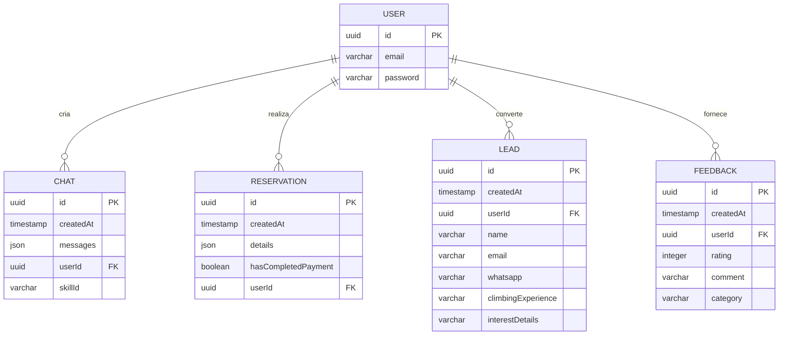

# Modelagem de Banco de Dados e Migrações (Drizzle ORM)

Este guia documenta o esquema de banco de dados (esquema relacional), as tabelas implementadas e os procedimentos para executar migrações e gerenciar os dados usando o **Drizzle ORM** com PostgreSQL.

---

## 📊 1. Diagrama de Relacionamentos (ER)



---

## 🗂️ 2. Dicionário de Tabelas (Drizzle Schema)

Os modelos de dados estão definidos no arquivo [`schema.ts`](./db/schema.ts).

### Tabela: `User`
Armazena a identidade do usuário para fins de autenticação e histórico pessoal.
*   `id` (`uuid`): Chave primária gerada aleatoriamente.
*   `email` (`varchar(64)`): Email do usuário (único).
*   `password` (`varchar(64)`): Senha criptografada (opcional, caso use OAuth).

### Tabela: `Chat`
Persiste o histórico de conversas do usuário com a inteligência artificial.
*   `id` (`uuid`): Chave primária do chat.
*   `createdAt` (`timestamp`): Data e hora de criação.
*   `messages` (`json`): Objeto contendo o array completo de mensagens de acordo com a estrutura do Vercel AI SDK.
*   `userId` (`uuid`): Chave estrangeira que referencia `User.id`.
*   `skillId` (`varchar(32)`): Define qual skill foi usada na conversa (ex: `flights`, `xperience-climb`).

### Tabela: `Reservation`
Gerencia os pacotes temporários e reservas de atividades contratadas pelo usuário.
*   `id` (`uuid`): Chave primária da reserva.
*   `createdAt` (`timestamp`): Data de criação.
*   `details` (`json`): Detalhes da reserva (voo ou passeio de escalada, número de passageiros/participantes, etc.).
*   `hasCompletedPayment` (`boolean`): Status do pagamento (se pago/aprovado).
*   `userId` (`uuid`): Chave estrangeira de `User.id`.

### Tabela: `Lead` (ADR-0002)
Salva contatos coletados no fluxo comercial do chatbot sob consentimento da LGPD.
*   `id` (`uuid`): Chave primária.
*   `createdAt` (`timestamp`): Data de cadastro.
*   `userId` (`uuid`): Chave estrangeira de `User.id` (opcional).
*   `name` (`varchar(256)`): Nome do lead.
*   `email` (`varchar(256)`): Email para contato.
*   `whatsapp` (`varchar(32)`): Telefone/WhatsApp do cliente.
*   `climbingExperience` (`varchar(64)`): Nível autodeclarado (`iniciante`, `intermediario`, `avancado`).
*   `interestDetails` (`varchar(1024)`): Informações opcionais de interesse.

### Tabela: `Feedback` (ADR-0002)
Registra as avaliações de estrelas e comentários submetidos no chat.
*   `id` (`uuid`): Chave primária.
*   `createdAt` (`timestamp`): Data de envio.
*   `userId` (`uuid`): Chave estrangeira de `User.id`.
*   `rating` (`integer`): Nota de 1 a 5 estrelas.
*   `comment` (`varchar(1024)`): Comentário textual do feedback.
*   `category` (`varchar(64)`): Categoria da avaliação (ex: `sistema`, `servico`, `instrutores`).

---

## 🚀 3. Fluxo de Desenvolvimento e Migrações

O projeto utiliza o **Drizzle ORM** com **Drizzle Kit** para geração e aplicação de modificações no banco de dados.

### A. Aplicando Migrações Existentes
Ao configurar o projeto pela primeira vez ou atualizar a branch, aplique as migrações no PostgreSQL executando:
```bash
pnpm tsx db/migrate
```

### B. Criando Novas Migrações
Caso você modifique ou adicione uma tabela no arquivo [`schema.ts`](./db/schema.ts):

1.  **Gere os arquivos de migração SQL** (isso criará os arquivos de instrução dentro da pasta `db/migrations/`):
    ```bash
    pnpm drizzle-kit generate:pg
    ```
2.  **Execute o script de aplicação** para atualizar a estrutura do banco físico:
    ```bash
    pnpm tsx db/migrate
    ```

### C. Visualizando os Dados com Drizzle Studio
Para inspecionar, adicionar ou modificar registros localmente através de uma interface administrativa web amigável, rode:
```bash
pnpm drizzle-kit studio
```
O console ficará disponível na porta padrão `http://localhost:54321` (ou na porta indicada no terminal).
