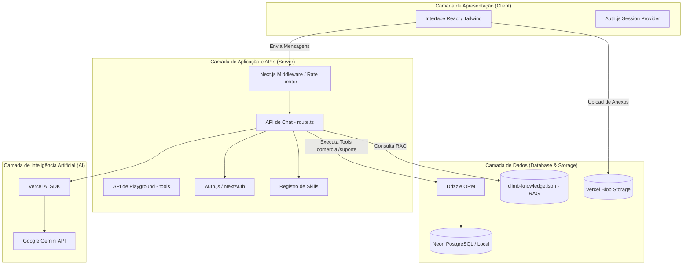

# Arquitetura Completa do Sistema

Este documento descreve a arquitetura de ponta a ponta da aplicação **gemini-chatbot**, detalhando as camadas de apresentação, processamento de inteligência artificial, persistência de dados, fluxo de integração e segurança.

---

## 🏗️ 1. Visão Geral da Arquitetura

O sistema adota uma arquitetura monolítica moderna baseada no **Next.js (App Router)**. A aplicação integra de forma nativa a interface de usuário (React), as APIs de backend (Serverless Route Handlers) e a orquestração do pipeline de Inteligência Artificial usando o **Vercel AI SDK**.



---

## 🎨 2. Camada de Apresentação (Frontend)

O frontend é construído com **React Server Components (RSC)** e **Client Components** estruturados no App Router do Next.js.

### A. Componentização Dinâmica (Server-Driven UI)
A interface de chat ([`chat.tsx`](file:///Users/govinda/projetos/gemini-chatbot/components/custom/chat.tsx)) renderiza uma lista de componentes de mensagens ([`message.tsx`](file:///Users/govinda/projetos/gemini-chatbot/components/custom/message.tsx)). Quando o backend retorna uma chamada de ferramenta (*tool call*):
1.  O cliente intercepta o payload JSON enviado no stream da API.
2.  A interface decide dinamicamente qual componente de UI rica renderizar (ex: [`ClimbPackageCard`](file:///Users/govinda/projetos/gemini-chatbot/components/climb/climb-components.tsx#L7) ou [`BookingStatusCard`](file:///Users/govinda/projetos/gemini-chatbot/components/climb/climb-components.tsx#L82)) com base no nome e no resultado da ferramenta executada.

### B. Sistema de Design e Estilização
*   **Tailwind CSS**: Usado para definir a identidade visual adaptativa (Earthy Dark Mode / Adventure Style para a marca Xperience Climb).
*   **Framer Motion**: Utilizado para transições de micro-interações fluidas (como as bounce animations no sucesso de pagamento).

---

## ⚙️ 3. Camada de Aplicação e Lógica de Negócios (Backend)

O backend é composto por endpoints HTTP (Route Handlers) e utilitários que executam no servidor Node.js.

### A. Rota do Chat ([`route.ts`](file:///Users/govinda/projetos/gemini-chatbot/app/%28chat%29/api/chat/route.ts))
Responsável por:
*   **Autenticação**: Validar a sessão do usuário usando **Auth.js** (NextAuth).
*   **Segurança (DDoS / Input Validation)**: Filtrar tamanhos de payload (limite de 1000 caracteres) e aplicar políticas de taxa limite de requisições por IP/User ID.
*   **Orquestração de Prompt Dinâmico (Skills)**: Carrega a persona e injeta regras de comportamento de acordo com a skill selecionada, ativando apenas as ferramentas autorizadas e impedindo que o modelo execute ações não planejadas.

### B. Módulo de Ferramentas (Tools Engine)
As ferramentas comerciais de banco de dados e APIs externas são expostas de forma centralizada no arquivo [`tools.ts`](file:///Users/govinda/projetos/gemini-chatbot/app/%28chat%29/api/chat/tools.ts).
Cada ferramenta possui um esquema de validação **Zod** garantindo segurança tipada contra injeções de parâmetros incorretos de IA.

---

## 🤖 4. Camada de Inteligência Artificial

A inteligência da aplicação é estruturada sobre o **Vercel AI SDK** integrado com o **Google Gemini**:
*   **Modelo Utilizado**: `gemini-1.5-flash` para interações gerais e rápidas de chat devido à alta performance e baixo custo por token.
*   **Retrieval-Augmented Generation (RAG)**: Em vez de manter grandes bases de conhecimento diretamente no prompt de sistema, a IA utiliza a ferramenta `searchClimbKnowledge` para realizar buscas parciais em um arquivo indexado local [`climb-knowledge.json`](file:///Users/govinda/projetos/gemini-chatbot/lib/data/climb-knowledge.json).

---

## 💾 5. Camada de Persistência de Dados e Armazenamento

A persistência do sistema é baseada em três pilares:

1.  **PostgreSQL (Neon DB ou Local)**:
    *   Gerenciado pelo **Drizzle ORM** (declarado em [`schema.ts`](file:///Users/govinda/projetos/gemini-chatbot/db/schema.ts)).
    *   Armazena usuários (`User`), histórico completo de chats (`Chat`), detalhes de reservas (`Reservation`), leads de conversão comercial (`Lead`) e avaliações de satisfação (`Feedback`).
2.  **Vercel Blob Storage**:
    *   Responsável por receber uploads de imagens e mídias enviados pelos usuários no chat.
3.  **Base Local Estática (RAG)**:
    *   Arquivo [`climb-knowledge.json`](file:///Users/govinda/projetos/gemini-chatbot/lib/data/climb-knowledge.json) que atua como base de dados estruturada para dúvidas de segurança e logística, simulando um banco vetorial local ágil.

---

## 🔒 6. Políticas de Segurança e Controle de Acesso
*   **Autenticação JWT**: Sessões persistidas de forma segura pelo NextAuth.js com expiração automática.
*   **Sandboxing de Tools**: Isolamento das permissões das ferramentas diretamente na lógica da rota API, impedindo chamadas maliciosas.
*   **Rate Limiting**: Algoritmo de controle de fluxo de requisições ativo em todas as rotas críticas de geração de texto de IA.

---

## 📂 7. Estrutura de Pastas e Arquivos (Layout do Projeto)

Abaixo está o mapeamento dos principais diretórios e arquivos que estruturam a arquitetura física da aplicação:

```
├── app/                  # Rotas da aplicação Next.js (App Router)
│   ├── (auth)/           # Sub-rotas e layouts de autenticação (login, register)
│   ├── (chat)/           # Página principal do chat e APIs de conversação
│   │   ├── api/          # APIs de processamento
│   │   │   ├── chat/     # route.ts e tools.ts (coração da IA)
│   │   │   └── history/  # Histórico de conversas
│   │   └── page.tsx      # Entrypoint da tela de chat
│   └── api/              # APIs gerais (relatório de testes, etc.)
├── ai/                   # Inicialização de provedores de modelos de IA e ações auxiliares
│   ├── index.ts          # Definição e exportação da instância do modelo (Gemini)
│   ├── actions.ts        # Funções servidoras auxiliares para geração de objetos estruturados
│   └── custom-middleware.ts # Customizações de middleware do AI SDK
├── components/           # Componentes React da UI (reutilizáveis e customizados)
│   ├── climb/            # climb-components.tsx (cards de reserva, sucesso, feedback)
│   ├── custom/           # chat.tsx, message.tsx, navbar.tsx, etc.
│   └── ui/               # Componentes visuais atômicos (botões, inputs de base)
├── db/                   # Configurações do Drizzle ORM e PostgreSQL
│   ├── migrations/       # Migrações SQL geradas pelo Drizzle Kit
│   ├── schema.ts         # Definições de tabelas e tipos do banco de dados
│   └── migrate.ts        # Script de execução de migrações
├── docs/                 # Documentação técnica e ADRs do sistema
├── lib/                  # Utilitários e helpers gerais
│   ├── ai/               # Registro de skills (skills-registry.ts)
│   └── data/             # climb-knowledge.json (base RAG)
└── tests/                # Suíte de testes unitários (Vitest) e E2E (Playwright)
```

### 🧠 Divisão de Responsabilidades: `/ai` vs `/lib/ai`

Para manter a separação de conceitos (*separation of concerns*), o código de inteligência artificial é dividido entre dois diretórios:

1.  **Diretório Raiz [`/ai`](file:///Users/govinda/projetos/gemini-chatbot/ai)** (Infraestrutura da IA):
    *   **Responsabilidade**: Configuração de baixo nível e inicialização dos provedores de modelos (SDK do Gemini) e Server Actions genéricas de IA (como geração estruturada de objetos mockados, listagens simples ou geradores de preço).
    *   **Arquivos-chave**:
        *   [`ai/index.ts`](file:///Users/govinda/projetos/gemini-chatbot/ai/index.ts): Inicializa o modelo de IA que será exportado para uso em toda a aplicação.
        *   [`ai/actions.ts`](file:///Users/govinda/projetos/gemini-chatbot/ai/actions.ts): Ações que utilizam `generateObject` para produzir respostas mockadas e estruturas auxiliares.

2.  **Diretório [`/lib/ai`](file:///Users/govinda/projetos/gemini-chatbot/lib/ai)** (Regras de Negócio e Comportamento):
    *   **Responsabilidade**: Lógica de aplicação e regras de negócio para a orquestração do comportamento conversacional do chatbot. Controla a persona das "Skills" ativas (como o fluxo da Xperience Climb ou o fluxo legada de voos), incluindo seus *system prompts*, as ferramentas liberadas e a identidade visual customizada do frontend para aquela sessão de chat.
    *   **Arquivos-chave**:
        *   [`lib/ai/skills-registry.ts`](file:///Users/govinda/projetos/gemini-chatbot/lib/ai/skills-registry.ts): Registro de configurações das Skills e mapeamento de permissões.


