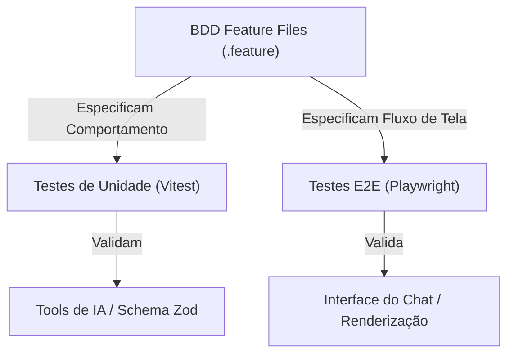

# Guia de Testes BDD, Integração e E2E (Qualidade e Validação)

Este guia detalha a arquitetura de testes do projeto, explicando como executá-los e como eles são estruturados para validar o comportamento do agente de inteligência artificial da **Xperience Climb**.

---

## 🎯 1. Visão Geral da Estrutura de Testes

Nossos testes são divididos em três camadas principais para garantir a qualidade de ponta a ponta:



Os arquivos de testes estão localizados no diretório [`tests/`](./tests).

---

## 📝 2. Especificações BDD (Behavior-Driven Development)

Utilizamos a sintaxe Gherkin (`Given`/`When`/`Then` ou `Dado que`/`Quando`/`Então`) para documentar e validar o comportamento do agente de forma legível por humanos. Os cenários estão em [`tests/features/`](./tests/features/):

*   [`climb-agent-spec.feature`](./tests/features/climb-agent-spec.feature): Especifica o comportamento lógico das ferramentas (RAG, validações LGPD, cálculo de pacotes).
*   [`climb-chat.feature`](./tests/features/climb-chat.feature): Especifica a jornada do usuário registrando-se, logando e interagindo com o chat.

---

## 🧪 3. Executando os Testes

### A. Testes de Unidade e Integração (com Vitest)
Estes testes verificam a lógica interna das ferramentas e as conexões de API sem precisar rodar a interface visual ou o banco de dados real (usando mocks do banco de dados e de sessão).

*   **Comando de Execução**:
    ```bash
    pnpm vitest run tests/climb.spec.ts
    ```
*   **O que valida**:
    *   **RAG**: Se a tool `searchClimbKnowledge` retorna os blocos corretos do arquivo JSON de conhecimento.
    *   **Pacotes**: Se a tool `listClimbPackages` retorna os preços corretos de acordo com a dificuldade.
    *   **LGPD**: Se a tool `saveLeadInfo` bloqueia ou permite o cadastro com base no parâmetro `consentGranted`.

### B. Testes End-to-End (com Playwright)
Estes testes simulam um usuário real interagindo com o navegador: abrindo a página, registrando uma conta fictícia, acessando o chat, enviando uma pergunta e esperando a IA renderizar os componentes na tela.

*   **Comando de Execução**:
    ```bash
    pnpm playwright test tests/climb-chat.spec.ts
    ```
*   **O que valida**:
    *   Se o formulário de cadastro de usuário funciona.
    *   Se o redirecionamento automático da autenticação ocorre com sucesso.
    *   Se a IA é capaz de acionar as ferramentas certas e se os cards ricos (como [`ClimbPackageCard`](./components/climb/climb-components.tsx#L7)) aparecem na tela do usuário.

---

## 📊 4. Relatórios de Execução de Testes e Consumo de Tokens

Para monitorar a performance e custo de tokens durante os testes E2E ou durante o desenvolvimento, criamos um sistema de relatórios de métricas.

Cada vez que o chatbot responde ou uma ferramenta é chamada no ambiente de teste, os tokens de entrada, saída e as ferramentas executadas são salvos no banco de dados local.

### Acessando os Relatórios:
1.  Inicie o servidor de desenvolvimento: `pnpm dev`.
2.  Acesse o dashboard no navegador: `http://localhost:3000/test-report` ou visualize as rotas de API em `/api/test-report`.
